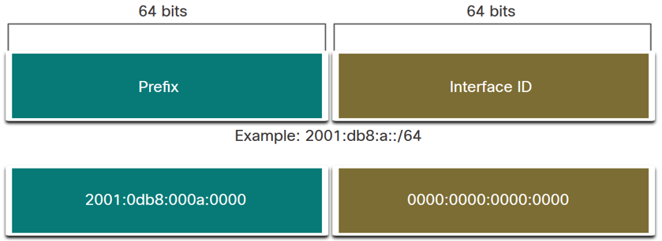

### Sommaire 

1. [Représentation de l'adresse IPv6](#1-représentation-de-ladresse-ipv6)
2. [Adresse globale de monodiffusion (GUA) IPv6](#2-adresse-globale-de-monodiffusion-gua-ipv6)
3. [Configuration de SLAAC](#3-configuration-de-slaac)
4. [Configuration d'un serveur DHCPv6](#4-configuration-dun-serveur-dhcpv6)
---

### 1. Représentation de l'adresse IPv6


- Les adresses IPv6 ont une longueur de **128 bits** et sont écrites en **hexadécimal**.
- Les adresses IPv6 **ne sont pas sensibles à la casse**.
- Le format privilégié pour noter une adresseIPv6 est **`x:x:x:x:x:x:x:x`**, où chaque **x** est constitué de **quatre valeurs hexadécimales.**
- Le term **hextet** est le terme utilisé pour désigner chaque quatre valeurs hexadécimales (16 bits),

#### Simplifier la représentation de l’adresse IPv6:

La première règle pour réduire la notation des adresses IPv6 consiste à **omettre les zéros (0) du début**.


Une suite de **double deux-points (::)** peut remplacer **toute chaîne unique** et continue d'un ou plusieurs segments de 16 bits (hextets) comprenant **uniquement des zéros.**


---

####  Longueur du préfixe IPv6

- La longueur du **`préfixe IPv6`** est utilisée pour indiquer la **partie réseau** de l'adresse IPv6.
- La longueur de préfixe peut être comprise entre **0 et 128**.
- La longueur du préfixe IPv6 recommandée pour les réseaux locaux et la plupart des autres types de réseaux est **`/64`**.




---

#### Types d'adressage IPv6


---


---


---


---

#### Différences entre Broadcast (IPv4) et Multicast (IPv6) :


---

### 2. Adresse globale de monodiffusion (GUA) IPv6

Sur un **routeur**, une **adresse de monodiffusion globale (GUA) IPv6** est configurée manuellement à l'aide de la commande de configuration de l'interface:

```cmd
R1(config)# interface G0/0
R1(config-if)# ipv6 address 2001:db8:6783:20::1/64
```


---
Sur un **hôte Windows** nous pouvons configurer manuellement **adresse GUA IPv6**, comme illustré sur la figure. Par conséquent, la plupart des hôtes Windows sont activés pour acquérir **dynamiquement** une configuration GUA IPv6 à partir d’un **serveur DHCPv6**.


---

#### Attribution d'un GUA IPv6 dynamqiue

Un routeur compatible IPv6 envoie périodiquement des **Annonces de routeur ICMPv6 _(RA - Router Advertising)_** , ce qui simplifie la façon dont un hôte peut acquérir dynamiquement sa configuration IPv6.

Le routeur utilise un de ces **trois méthodes** définies par le message d'annonce du routeur (RA - Router Advertising):


---

#### Trois indicateurs de message RA

Un **client** obtient une GUA IPv6 en envoyant un message **_RS (Router Sollicitation)_**, au routeur.

Le **routeur** répond avec un message **_RA (Router Advertising)_**, créé par **`ICMPv6`**, avec une de ces paramètres qui comprend **trois indicateurs**:
 * **Indicateur A** - Indicateur de Configuration Automatique d'adresse qui signifie d'utiliser **SLAAC (Stateless Address Autoconfiguration)** pour créer une GUA IPv6.
 * **Indicateur O** - Autre Indicateur de Configuration qui signifie que des **informations supplémentaires** sont disponibles auprès d'un **serveur DHCPv6 sans état** (exemple: adresse IP du DNS).
 * **Indicateur M** - Indicateur de Configuration d’Adresse Gérée qui signifie qu'il faut utiliser un **serveur DHCPv6 avec état** pour obtenir un GUA IPv6.

##### En utilisant différentes combinaisons des indicateurs A, O et M, les messages RA informent l'hôte des options dynamiques disponibles.


#### Exemple d'une capture d'une RA avec l'indicateur O = 1 (Other configuration)


---

### 3. Configuration de SLAAC

La méthode **SLAAC** permet aux hôtes de **créer leur propre IPv6 GUA unique sans les services d'un serveur DHCPv6**.

- SLAAC est un service sans état **_(Stateless Auto-Configuration)_**, ce qui signifie qu'il n'y a pas de serveur qui conserve les informations d'adresse réseau pour savoir quelles adresses IPv6 sont utilisées et lesquelles sont disponibles.
- SLAAC peut être déployé en tant que **SLAAC uniquement**, ou **SLAAC avec DHCPv6**.


#### Activation de SLAAC uniquement (sans DHCP)

Le SLAAc doit être activé sur le routeur. 

On commence par configurer l'interface **R1 G0/0** avec la config IPv6 suivante:
- Adresse IPv6 Link-local : **fe80::1**
- GUA IPv6 : **2001:db8:acad:1::1**
- Réseau :    **2001:db8:acad:1::/64**
- Groupe de multidiffusion tous les nœuds IPv6 : **ff02::1**


Puis on **active le SLAAC** avec cette commande:  

```cmd   
R1(config)# ip unicast-routing
```

**`R1`** est maintenant rejoint le **groupe de multidiffussion tous les routeurs IPv6 ``ff02::2``**

Il va commencer à envoyer des **messages RA** toutes les 200 secondes contenant des informations de configuration d'adresse aux hôtes à l'aide de SLAAC.


---

#### Processus d'hôte pour générer une Adresse globale de monodiffusion (GUA) IPv6

À l'aide de SLAAC, un hôte acquiert ses informations de **sous-réseau IPv6 64 bits** de la **RA** du routeur et doit générer le reste de **l'identificateur d'interface 64 bits** à l'aide de l'un des éléments suivants :

- **Génération aléatoire** - ID de l'interface 64-bit est généré aléatoirement par le système d'exploitation du client. C'est la méthode maintenant utilisée par les hôtes Windows 10/11.
- **EUI-64** - L'hôte crée un ID d'interface en utilisant son adresse MAC 48 bits et insère la valeur hexadécimale de **`fffe`** au milieu de l'adresse.


---
### 4. Configuration d'un serveur DHCPv6

### 4.1 Activation de SLAAC avec un serveur DHCPv6 sans état

L'option de **serveur DHCPv6 sans état** nécessite que le **routeur annonce les informations d'adressage réseau IPv6 dans les messages RA**.

Il y a **cinq étapes pour configurer** et vérifier un routeur en tant que **serveur DHCPv6 sans état**:

```yaml   
# 1-Activez le SLAAC 
R1(config)# ipv6 unicast-routing

# 2-Définissez un nom de pool DHCPv6
R1(config)# ipv6 dhcp pool POOL1

# 3-Configurer juste les options du pool DHCPv6
R1(config-dhcpv6)# dns-server 2001:DB8:ACAD:2::2
R1(config-dhcpv6)# domain-name stateless.com

# 4-Liez l'interface au pool DHCPv6
R1(config)# int g0/0
R1(config-if)# ipv6 dhcp server POOL1

# 5-Changez manuellement l'indicateur O de 0 à 1
R1(config-if)# ipv6 nd other-config-flag

# Les messages RA envoyés sur cette interface indiquent aux clients que des informations supplémentaires sont disponibles auprès d'un serveur DHCPv6 sans état
```


---

#### Processus d'hôte pour générer une Adresse globale de monodiffusion (GUA) IPv6

Si une **RA** indique la méthode **DHCPv6 sans état**, l'hôte utilise les informations contenues dans le message RA pour l'adressage et **contacte un serveur DHCPv6** pour obtenir des **informations supplémentaires (comme DNS, Domain name, …).**


---

### 4.2 Configuration d'un serveur DHCPv6 avec état

L'option de serveur DHCP avec état exige que le routeur compatible IPv6 indique à l'hôte de contacter un serveur DHCPv6 pour obtenir toutes les informations d'adressage réseau IPv6 nécessaires.

Il y a **cinq étapes pour configurer** et vérifier un routeur en tant que **serveur DHCPv6 avec état**:

```yaml   
# 1-Activez le SLAAC 
R1(config)# ipv6 unicast-routing

# 2-Définissez un nom de pool DHCPv6
R1(config)# ipv6 dhcp pool POOL2

# 3-Configurer le pool DHCPv6
R1(config-dhcpv6)# address prefix 2001:DB8:ACAD:3::/64 lifetime 172800 86400
R1(config-dhcpv6)# dns-server 2001:DB8:ACAD:2::2 
R1(config-dhcpv6)# domain-name stateful.com

# 4-Liez l'interface au pool DHCPv6
R1(config)# int g0/0
R1(config-if)# ipv6 dhcp server POOL2

# 5-Changez manuellement l'indicateur M de 0 à 1
R1(config-if)# ipv6 nd managed-config-flag

# Les messages RA envoyés sur cette interface indiquent aux clients d'utiliser serveur DHCPv6 avec état pour créer leur propre IPv6 GUA et recevoir des informations supplémentaires
```


---
#### Processus d'hôte pour générer une Adresse globale de monodiffusion (GUA) IPv6

Si une **RA** indique la méthode **DHCPv6 avec état**, l'hôte utilise les informations contenues dans le message RA pour l'adressage et **contacte un serveur DHCPv6** pour obtenir **une adresse GUA IPv6** et recevoir des **informations supplémentaires**


Vérifier sur le **routeur (serveur DHCPv6)** l'adresse IPv6 obtenue par le client, en utilisant la sortie de cette commande:


---
